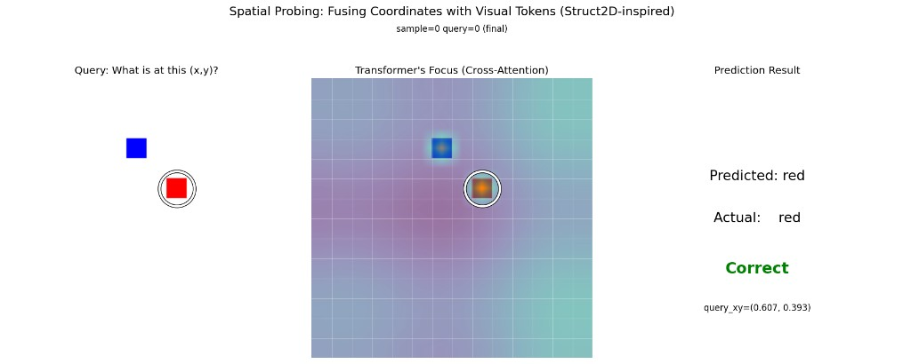

# Spatial-Probing Transformer (PoC)

Custom scaled dot-product multi-head attention, patch + 2D sinusoidal embeddings, a small **SpatialProber** (image self-attention + coordinate cross-attention), synthetic point-probe data, training, and attention visualization.

## Layout

- `spatial_probing_transformer/` — importable Python package (model, embeddings, blocks, prober, data, train, vis).
- `scripts/train.py` — thin entrypoint for training.
- `tests/` — pytest smoke tests.
- `outputs/` — generated artifacts (`attn.pt`, `plots/*.png`); tracked via `.gitkeep` only.
- `.venv/` — local virtual environment (gitignored). Create it once per clone; see below.

## Quick start

Do this **once** after cloning (from the **repository root** — the folder that contains `pyproject.toml`):

```bash
cd spatial_probing_transformer

python3 -m venv .venv
source .venv/bin/activate          # Windows (cmd): .venv\Scripts\activate.bat
                                   # Windows (PowerShell): .venv\Scripts\Activate.ps1

pip install -U pip
pip install -e ".[dev]"
```

That installs the package in **editable** mode plus dev tools (`pytest`), with dependencies from `pyproject.toml` (`torch`, `matplotlib`).

### Every new terminal session

Activate the same environment, then run commands with **`python`** (points at the venv’s interpreter):

```bash
cd spatial_probing_transformer
source .venv/bin/activate          # Windows: see paths above
```

### Train

```bash
python scripts/train.py
```

Same thing without the script wrapper:

```bash
python -m spatial_probing_transformer.train
```

Training writes **`outputs/attn.pt`** and attention PNGs under **`outputs/plots/`** (for example `attn_step_250.png`, `attn_final.png`).

### Tests

```bash
python -m pytest tests/
```

### Without activating (optional)

You can always invoke the venv interpreter explicitly:

```bash
.venv/bin/python scripts/train.py
.venv/bin/python -m pytest tests/
```

### Troubleshooting

- **`ModuleNotFoundError: spatial_probing_transformer`**: run `pip install -e ".[dev]"` **with the venv activated** (or use `.venv/bin/pip install -e ".[dev]"` once).
- **Wrong Python**: confirm `which python` (macOS/Linux) or `where python` (Windows) resolves inside `.venv` after `activate`.

## Use the library

```python
from spatial_probing_transformer import SpatialProber
```
